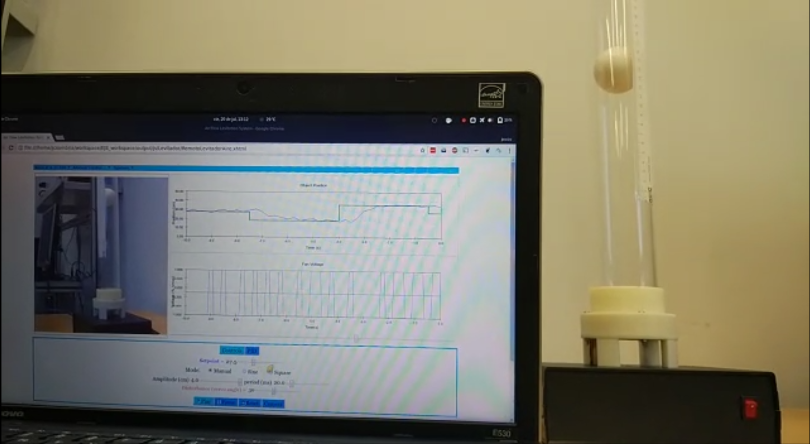
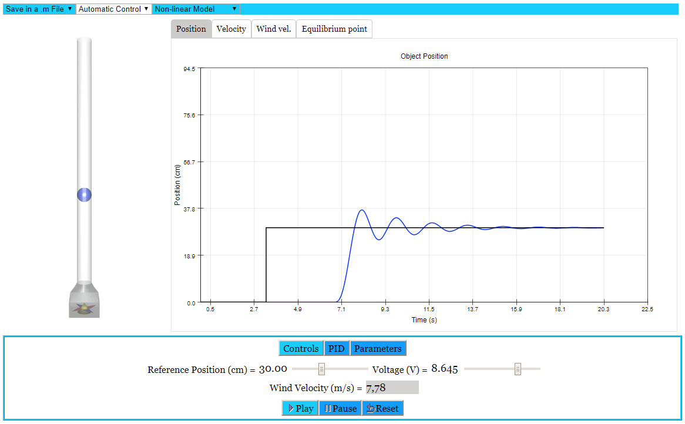

## The air levitator system

The air levitator allows to perform a variety of control engineering experiences with a fast dynamics system. The whole setup consists, basically, on a light ball, a tube, a fan to create the air flow inside the tube that will levitate the ball, a servo that moves a flap for introducing perturbations, and the required sensors to measure both the position of the levitating ball and the air speed.

The air levitator system can be used as a hands-on traditional laboratory or as a remote lab through the included web application. The equipment also comes with a web simulation of the system that allows performing lab activities in a virtual way.

### Video demonstration

[Click here for the video](https://youtu.be/74lKE0QAqpg)

### Real lab computer application

You can get the most recent version of the air levitator real lab computer application to experiment with the system from [Air-Levitator](https://github.com/UNEDLabs/Air-Levitator/).

### Virtual lab computer application

You can also get the most recent version of the air levitator virtual lab computer application from [Air-Levitator](https://github.com/UNEDLabs/Air-Levitator/).
